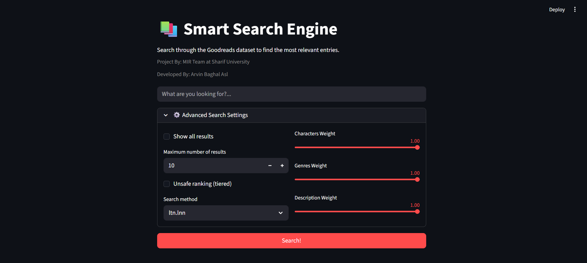

# 📚 Goodreads Information Retrieval System



### 👤 Author
* **Developer:** [Arvin Baghal Asl](https://github.com/arvinasli)
* **Institution:** Sharif University of Technology (SUT)
* **Course:** Modern Information Retrieval (Spring 2026)  
* **Instructor:** [Dr. Mahdieh Soleymani Baghshah](https://scholar.google.com/citations?user=S1U0KlgAAAAJ&hl=en)

---

## 🔍 Overview

Finding your next great read is more than just looking at a star rating. It requires sophisticated retrieval methods capable of handling nuanced summaries and user queries.

I designed and developed a complete, end-to-end **Information Retrieval (IR) Pipeline** for a large Goodreads dataset. From mitigating corpus pollution via near-duplicate text detection to generating contextual query-highlighted snippets and evaluating relevance models, this project serves as a robust, highly optimized engine for book discovery.

---

## 🏗 System Architecture

The codebase is engineered with a strict separation of concerns, split into two core modules: **UI** (Interaction layer) and **Logic** (Core algorithmic engine).

### 🖥 UI Module
An interactive search dashboard built using **Streamlit**. It connects to the core processing engine to sanitize user input, run spell-correction pipelines, retrieve documents, and display ranked book cards alongside dynamic snippets.

### ⚙️ Core Logic Engine
The processing framework consists of 8 modular sub-components designed and implemented from scratch:

| # | Component | My Implementation Details |
| :--- | :--- | :--- |
| 1 | **Preprocess** | Converts raw documents into clean tokens by stripping URLs/emails via RegEx, normalizing cases, removing stop-words, and executing stemming/lemmatization. |
| 2 | **LSH (Near-Duplicate)** | Optimizes corpus health using a **MinHashLSH** pipeline ($k$-word shingling, permutation-based signature generation, and band-bucketing) to prune near-identical summaries. |
| 3 | **Indexing** | Builds inverted indexes for separate fields (`description`, `genres`, `characters`) configured in a `{term: {doc_id: tf}}` schema, alongside a multi-tier structure for accelerated unsafe ranking. |
| 4 | **Spell Correction** | Features an isolated error-tolerant system using a hybrid Jaccard Similarity (k-gram lookup) combined with a Normalized TF corpus frequency score to rank corrections. |
| 5 | **Scorer** | Implements three independent ranking regimes: Vector Space Model (**VSM** with `lnc.ltc` configuration), **Okapi BM25** with document-length normalization, and a **Unigram Language Model** supporting Naive, Dirichlet (Bayes), and Jelinek-Mercer (Mixture) smoothing. |
| 6 | **Search Engine** | Coordinates field-specific index scoring and orchestrates safe/unsafe retrieval paradigms. |
| 7 | **Snippet Generation** | Automatically isolates premium document segments containing high density query-term clusters, formatting them with ellipses (`...`) and syntax highlighting (`***query_term***`). |
| 8 | **Evaluation** | Features an analytics suite calculating precision, recall, **MAP**, **NDCG**, and **MRR** metrics to benchmark the system against reference test collections. |

---

## 🚀 Getting Started

### 1. Prerequisites & Dataset
Extract the provided data package into your local data folder before launching the modules:
* **Target Archive:** `release/top_3000_rated_books.rar`

### 2. Environment Setup
Install the necessary python environments:
```bash
pip install -r requirements.txt
